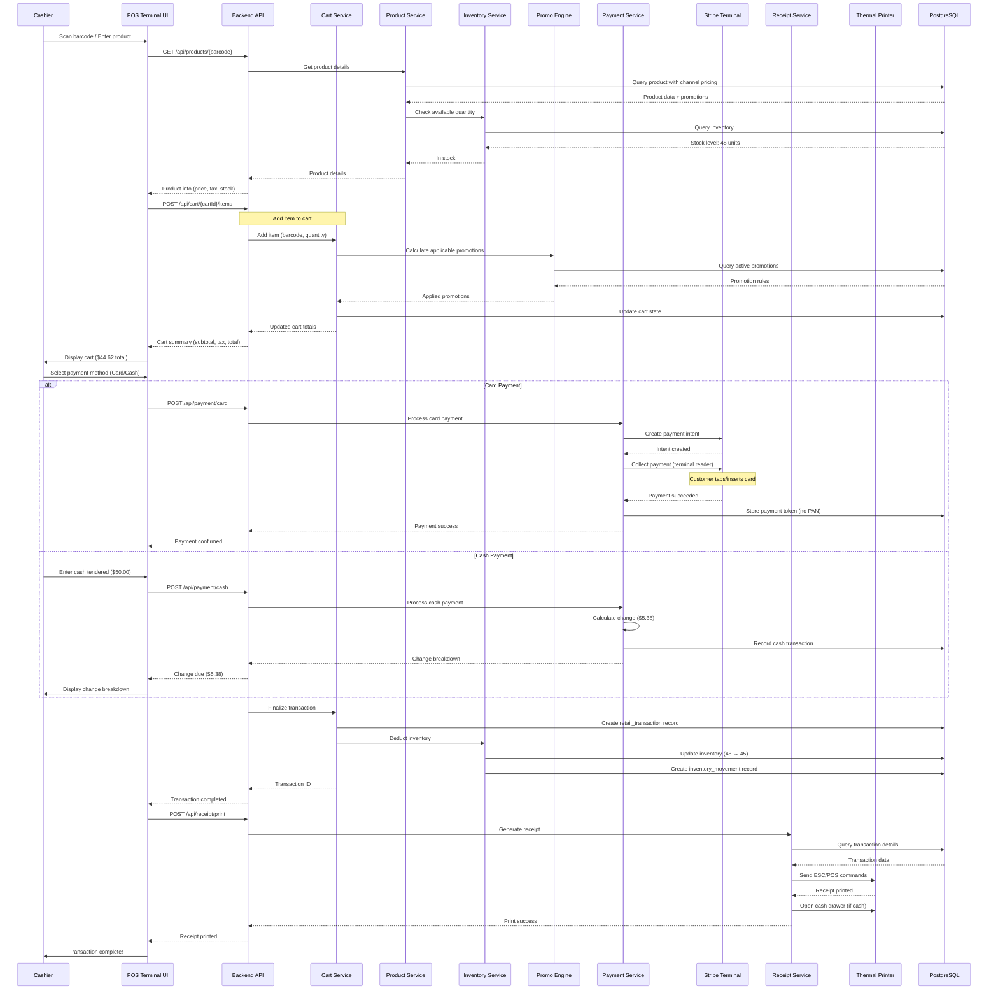
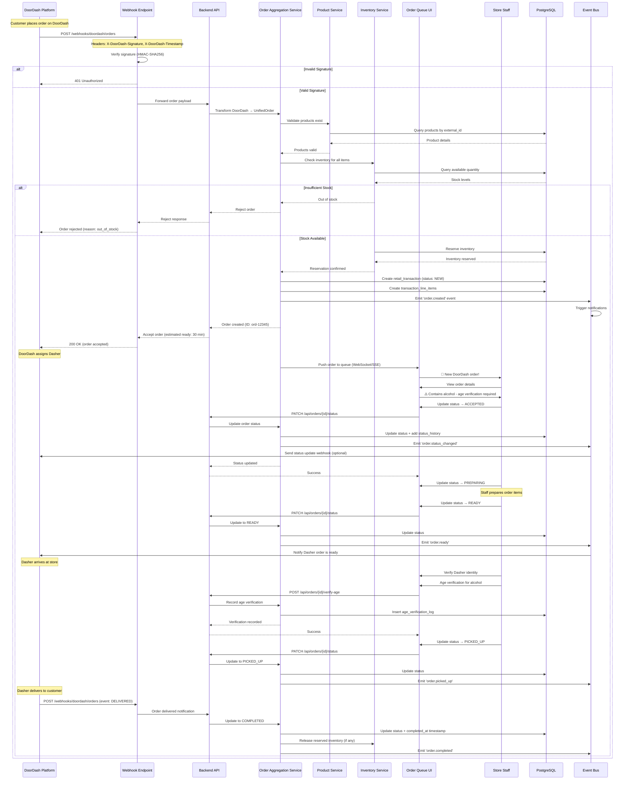
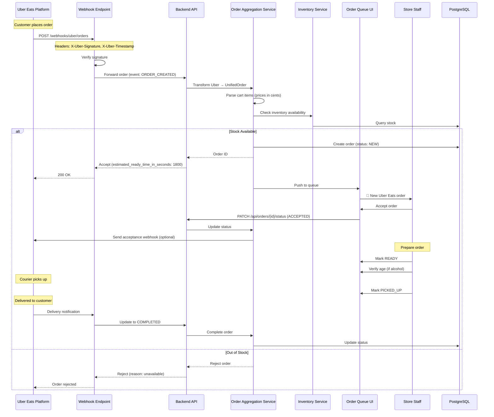
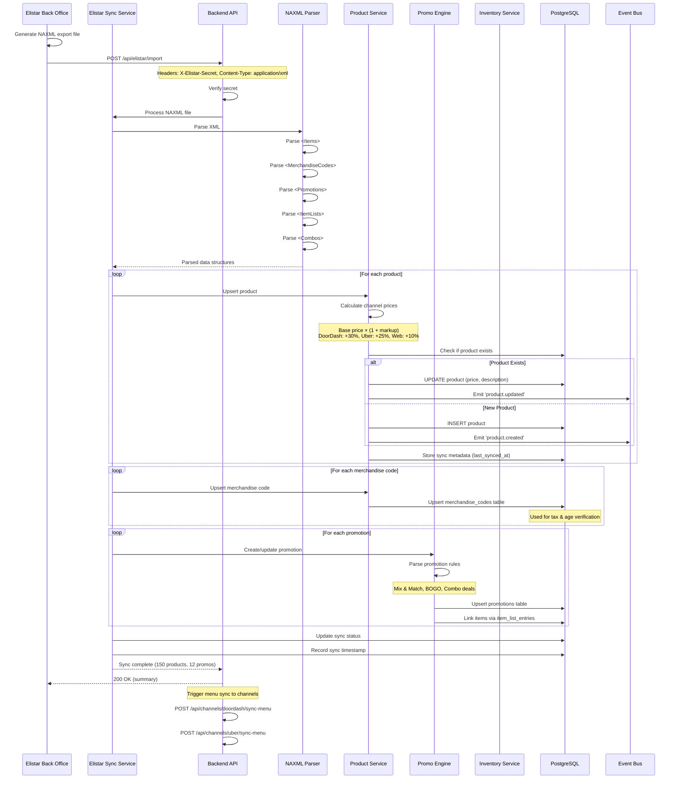
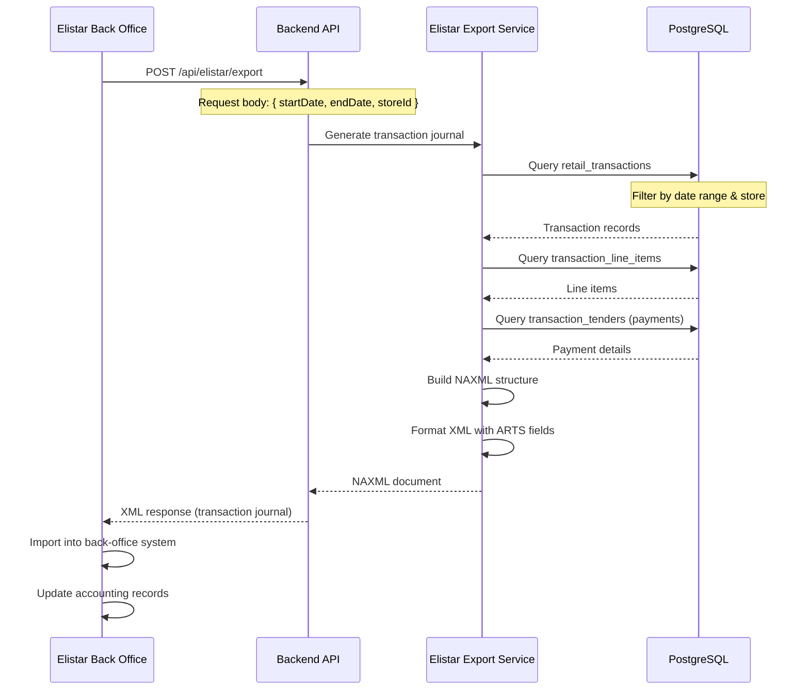
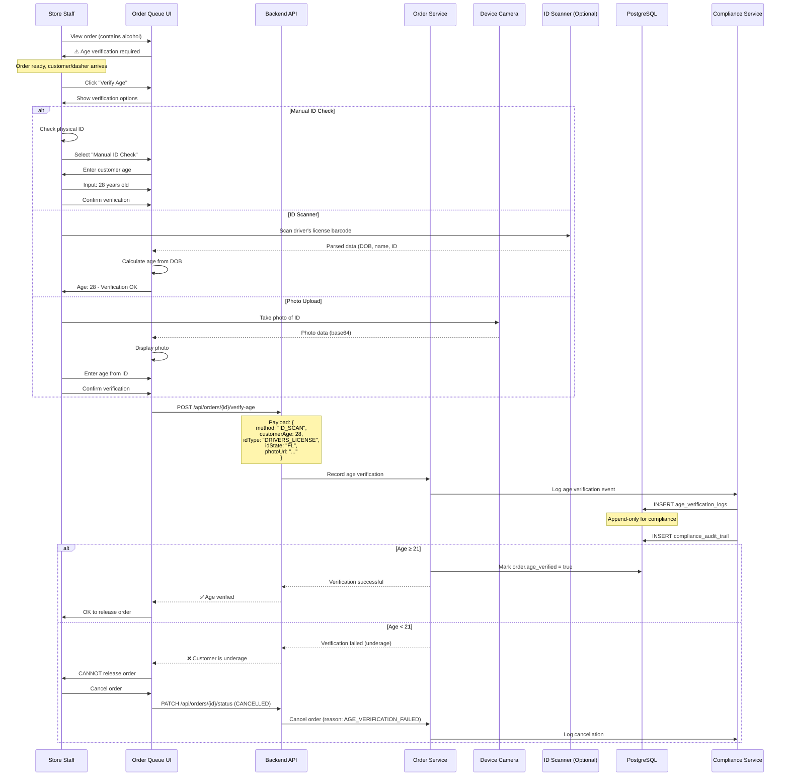
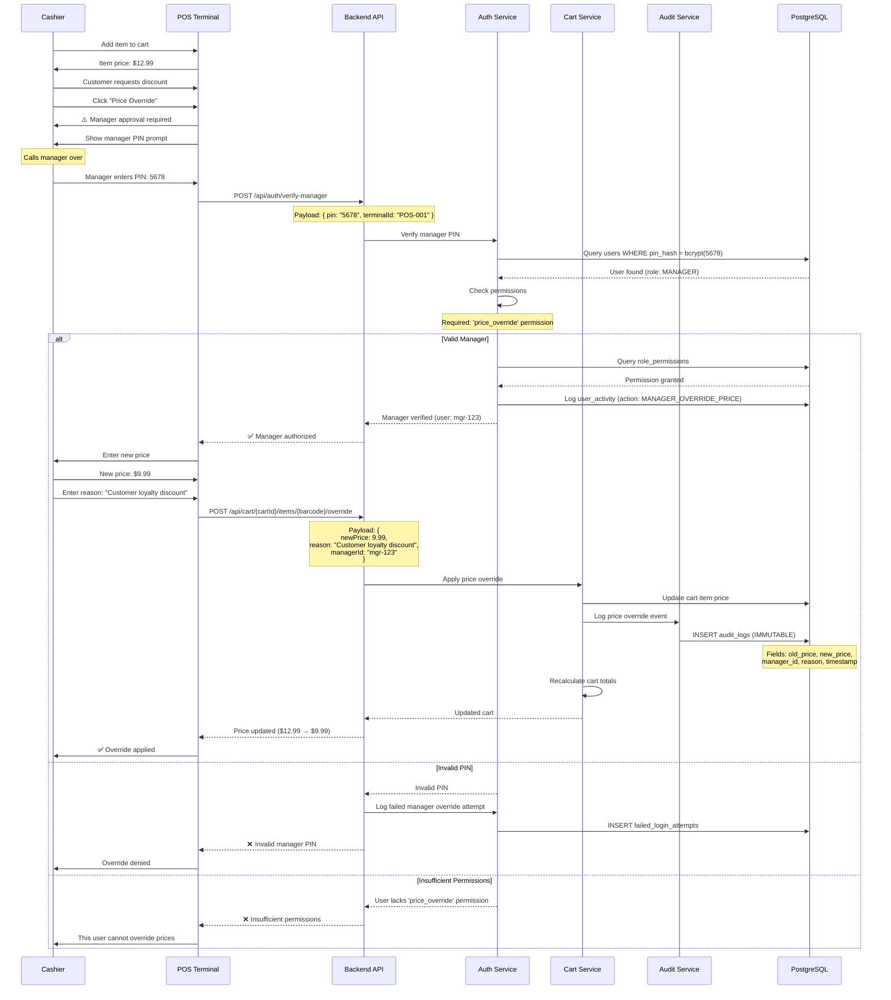
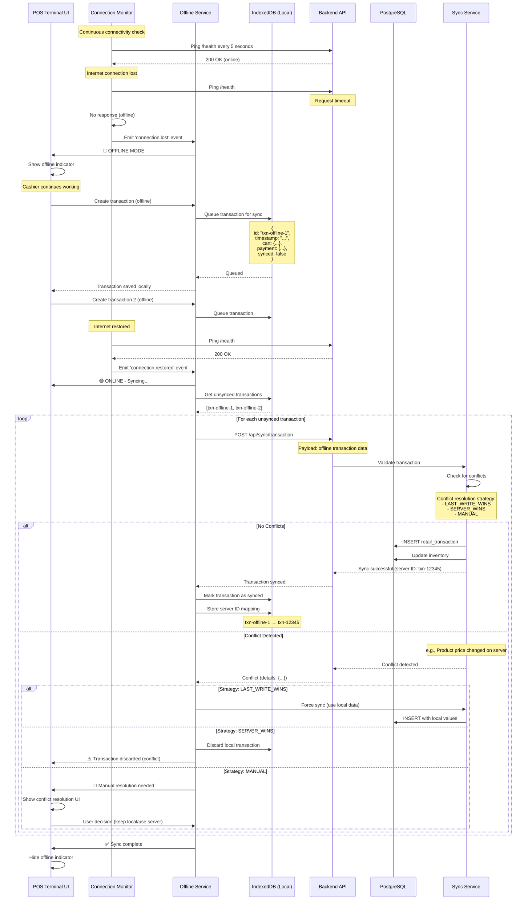
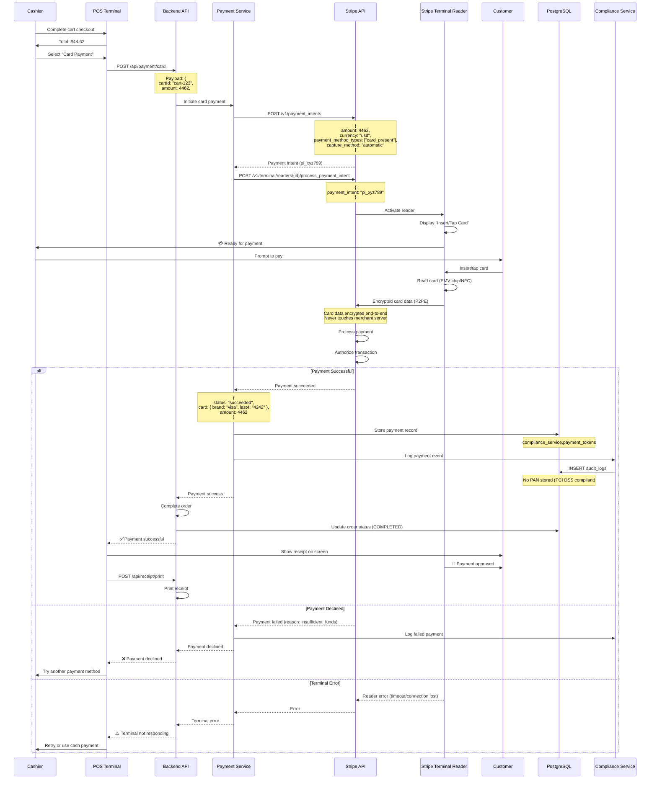

# OpenCommerce Sequence Diagrams

## Table of Contents
1. [In-Store POS Transaction Flow](#in-store-pos-transaction-flow)
2. [DoorDash Order Flow](#doordash-order-flow)
3. [Uber Eats Order Flow](#uber-eats-order-flow)
4. [Elistar Product Sync Flow](#elistar-product-sync-flow)
5. [Age Verification Flow](#age-verification-flow)
6. [Manager Override Flow](#manager-override-flow)
7. [Offline Sync Flow](#offline-sync-flow)
8. [Payment Processing Flow](#payment-processing-flow)

---

## 1. In-Store POS Transaction Flow

### Scenario: Customer purchases items at POS terminal

### Key Points:
- **Inventory Check**: Real-time stock verification before adding to cart
- **Promotion Auto-Apply**: Promo engine runs on cart changes
- **PCI Compliance**: No card data stored, only Stripe tokens
- **ARTS Compliance**: Transaction logged per retail standards
- **Event Sourcing**: All changes create audit events

---

## 2. DoorDash Order Flow

### Scenario: Customer orders via DoorDash app

### Key Points:
- **Signature Verification**: HMAC-SHA256 prevents webhook spoofing
- **Inventory Reservation**: Stock held when order accepted
- **Unified Order Format**: DoorDash order transformed to internal format
- **Real-time Updates**: WebSocket pushes to Order Queue UI
- **Age Verification**: Required for alcohol orders
- **Event-Driven**: All status changes emit events for audit

---

## 3. Uber Eats Order Flow

### Scenario: Customer orders via Uber Eats app

### Key Differences from DoorDash:
- **Price Format**: Uber uses cents (e.g., 1624 = $16.24)
- **Event Types**: ORDER_CREATED, ORDER_ACCEPTED, ORDER_CANCELLED
- **Response Format**: estimated_ready_time_in_seconds vs. ISO timestamp

---

## 4. Elistar Product Sync Flow

### Scenario: Import products/promotions from Elistar back-office

### Export Flow (Transactions to Elistar)

---

## 5. Age Verification Flow

### Scenario: Delivering alcohol order requiring age verification

### Compliance Requirements:
- **Audit Trail**: All verification attempts logged (append-only)
- **Photo Storage**: Optional, encrypted storage of ID photos
- **Regulatory Reporting**: Age verification logs exportable for audits
- **Failure Handling**: Orders must be cancelled if verification fails

---

## 6. Manager Override Flow

### Scenario: Price override requiring manager approval

### Other Manager Override Scenarios:
- **Void Transaction**: Requires manager PIN + reason
- **Refund**: Manager approval for returns > $50
- **Cash Drawer Open**: Manager override to open drawer mid-shift
- **Discount Apply**: Manager-only promotions

---

## 7. Offline Sync Flow

### Scenario: POS terminal loses internet, then reconnects

### Offline Capabilities:
- **Full POS Functionality**: Create transactions, process payments
- **Local Cache**: Products, prices, promotions cached in IndexedDB
- **Sync Queue**: All changes queued for upload when online
- **Conflict Resolution**: Configurable strategies
- **Data Consistency**: Server is source of truth

---

## 8. Payment Processing Flow (Stripe Terminal)

### Scenario: Card payment at POS terminal

### Key Security Features:
- **P2PE (Point-to-Point Encryption)**: Card data encrypted at reader
- **No PAN Storage**: Only tokenized data stored (last4 + token)
- **PCI DSS Scope Reduction**: Terminal handles card data
- **Audit Trail**: All payment attempts logged (compliance)
- **Idempotency**: Duplicate payment prevention via idempotency keys

---

## Summary

These sequence diagrams cover the **8 critical flows** in OpenCommerce:

1. ✅ **In-Store POS Transaction** - Full cart → payment → receipt flow
2. ✅ **DoorDash Order** - Webhook → queue → age verification → pickup
3. ✅ **Uber Eats Order** - Similar to DoorDash with platform differences
4. ✅ **Elistar Sync** - Product/promotion import + transaction export
5. ✅ **Age Verification** - Compliance for alcohol delivery
6. ✅ **Manager Override** - Authorization for sensitive operations
7. ✅ **Offline Sync** - Offline-first operation + conflict resolution
8. ✅ **Payment Processing** - Stripe Terminal integration (P2PE)

Each diagram shows:
- **Actors**: Users, services, external systems
- **Data Flow**: Request/response patterns
- **Error Handling**: Alternative paths (alt/else)
- **Compliance**: Audit logging, PCI DSS, age verification
- **Event-Driven**: Event bus emissions for async processing

---

**Document Version**: 1.0
**Last Updated**: 2025-11-14
**Format**: Mermaid sequence diagrams (GitHub/Markdown compatible)
